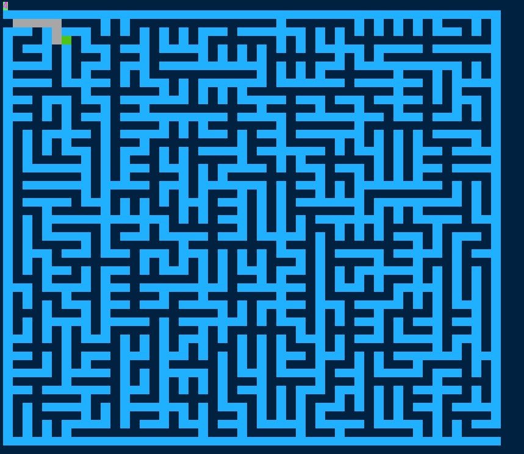

# Maze-creator-game
**1. Base on the Prim Algorithm to create the maze**

* I have also looked at other maze generation algorithm, such as:
> 1.1 DFS(Backtracking): at first, it creates a route to the end,
>and the logical judgement of which is that: 
>checking if there is no way to go, if so, pick one point at random to continue;  
>But, it has an obvious drawback: You can see very obvious route, which is not good
>for the player.
>
> 1.2 .............
>
> 1.3 .............

- - -
**2.Visual display**
 

**After a maze has been generated;**
> * The green color node represents the current position;
> * The gray color node represents the path traveled;
> * The red color route represents the path to the end from current position;

**Before a maze has been generated;**
> * The green color node represents the 'ROAD_WAITING';
> * The gray color node represents the selected point at random;

- - -
**3. Base on the BFS algorithm to find the shortest route to the end**

- - -
**4.Personal summary**
1. This is my first time to write algorithms with C++, 
I never meet such huge difficulties, C++ not equal the JAVA;

2. Because the time limit, I do not finish this very perfect...